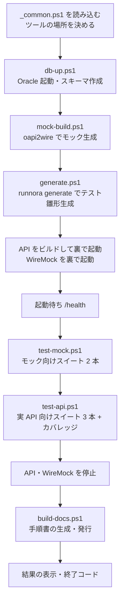
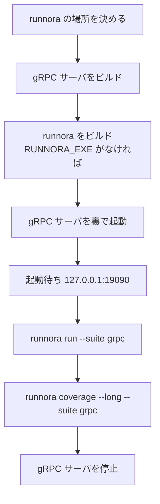

# スクリプトの処理解説（run-all.ps1 / run.ps1）

`api-test/scripts/run-all.ps1` と `grpc-test/scripts/run.ps1` が、内部で何を・どの順で・何のために実行しているかを説明します。
スクリプトを使わずに同じことを手で行う方法は [コマンドマニュアル](command-manual.md) を参照してください。

## 1. 前提：スクリプトとツールの分担

テストの中身（接続先、前後処理 SQL、期待する結果、どの runbook をまとめて流すか）は、スクリプトには書いていません。
すべて `runnora.yaml` と各 runbook の `runnora:` ブロックにあり、runnora がそれを読んで実行します。

| 書いてある場所 | 内容 |
|---|---|
| `runnora.yaml` の `environments` | 環境（`unit`＝実 API、`mock`＝WireMock、`grpc-test` は `unit`）ごとの接続先（`vars`）、Oracle の接続、全シナリオ共通の前後処理（`hooks`） |
| `runnora.yaml` の `suites` | スイート（まとめて流す runbook の選び方）、使う環境、スイート固有の前処理 |
| runbook の `runnora:` ブロック | シナリオ ID、そのシナリオだけの前後処理 SQL、期待する結果（`expect`） |
| スクリプト（`scripts/*.ps1`） | **runnora の範囲外のこと**だけ：DB・API・WireMock・gRPC サーバの起動と停止、起動待ち、ツールのビルド、モック資産の生成、手順書の発行 |

そのため、スクリプトが runnora に渡すのは `run --suite <スイート名>` だけです。
レポートと証跡の保存先（`reports/<日時>-<スイート名>/`）も runnora が決めます。

## 2. api-test/scripts/run-all.ps1

API テストのフルセットを一括実行します。



オプション：

| オプション | 既定 | 意味 |
|---|---|---|
| `-DocFormat Html\|Pdf\|Both\|None` | `Html` | 最後に発行する手順書の形式。`None` は原稿の生成だけ |
| `-SkipDbInit` | なし | `db-up.ps1`（Oracle の起動とスキーマの作り直し）を省く。Oracle が起動済みのとき |

### 2.1 共通設定（_common.ps1）

各スクリプトが最初に読み込む共通部分です。

| 処理 | 内容 |
|---|---|
| ツールの場所を決める（`Resolve-Tool`） | `runnora`・`oapi2wire` を、環境変数（`RUNNORA_EXE`・`OAPI2WIRE_EXE`）→ 隣のリポジトリ（`..\..\runnora\runnora.exe` など）→ PATH の順で探す。見つからなければ停止 |
| 接続先の定数 | 起動待ちに使う URL（API：`http://127.0.0.1:18081`、WireMock：`http://127.0.0.1:18080`）。runbook の接続先は `runnora.yaml` の `vars` で、スクリプトの定数は起動待ちにだけ使う |
| `Invoke-Runnora` | `runnora run --suite <スイート>` を実行し、画面の出力を `reports/<日時>-<スイート>/runnora.log` に移す。終了コードで OK / NG を表示し、NG なら出力の先頭 15 行を表示する |
| `Get-RunFolder` | runnora が作った最新の実行フォルダ（`reports/<日時>-<スイート名>[-n]`）を探す |
| `Write-RunSummary` | 結果の件数と、各スイートの `summary.html` の場所を表示する |
| `Get-LogDir` | サーバのログの置き場所 `logs/`（毎回上書き） |
| `Wait-Http` | URL が応答するまで待つ（404 などでも応答があれば起動済みとみなす） |

### 2.2 手順ごとの処理

**① Oracle の起動とスキーマの作成（db-up.ps1）**

- `docker compose up -d oracle` で Oracle Database Free のコンテナ（`runnora-e2e-oracle`、ホスト側ポート 1522）を起動する。
- `docker inspect` でヘルスチェックが `healthy` になるまで最大 600 秒待つ。
- `sqlplus` で `db/01_create_user.sql`（LIBAPP ユーザーの作成）と `db/02_schema.sql`（テーブル定義）を流す。
- 何度実行しても「テーブル定義だけでデータなし」の状態になります。データはテスト実行時に runnora の前処理（`sql/common/*.sql`）が入れます。

**② モック資産の生成（mock-build.ps1）**

| 順 | コマンド | 目的 |
|---|---|---|
| 1 | `oapi2wire validate --openapi openapi/library-api.yaml --cases mock/mock-cases.yaml --responses-root fixtures/responses` | case YAML と OpenAPI の整合性を検査する |
| 2 | `tools/contract-check` をビルドして実行 | 契約テストの期待本文（suite の `vars.expected`）と、モックが返すファイル（`bodyFile`）が同じファイルを指しているか検査する（e2e 独自の検査） |
| 3 | `oapi2wire build ... --out mock/wiremock-out --clean --fail-on-missing-operation --fail-on-missing-body-file` | WireMock の `mappings/` と `__files/` を作り直す |

**③ テスト雛形の生成（generate.ps1）**

- `runnora generate --openapi openapi/library-api.yaml --clean --force`
- OpenAPI の operation ごとに `runbooks/generated/<タグ>/<操作>.template.yml`・`.suite.yml` と `cases/generated/.../default.json` を作り直します。
- 生成物には手を加えません。育てるテストは `runbooks/contract/` に複製して使います。

**④ API と WireMock の起動**

- `go build -C api -o ../bin/library-api.exe .` で図書 API をビルドし、`Start-Process` で裏で起動する（ログは `logs/api-server.log`）。
- `java -jar <WIREMOCK_JAR> --port 18080 --bind-address 127.0.0.1 --root-dir mock/wiremock-out --disable-banner` で WireMock を裏で起動する（ログは `logs/wiremock.log`）。
  - jar の場所は環境変数 `WIREMOCK_JAR`（既定 `..\..\runnora\docs\tools\wiremock-standalone-3.13.2.jar`）。
- `Wait-Http` で両方の `/health` が応答するまで最大 60 秒待つ。

**⑤ モックに対するテスト（test-mock.ps1）**

| 実行名 | コマンド | 内容 |
|---|---|---|
| mock-generated | `runnora run --suite generated-mock` | 生成テスト 8 本。example 値とステータスを検証 |
| mock-contract | `runnora run --suite contract-mock` | 契約テスト 8 本。ステータス、本文の一致、OpenAPI の応答スキーマを検証 |

スイートの `env: mock` により、接続先は WireMock（`http://127.0.0.1:18080`）になります。DB は使いません。

**⑥ 実 API に対するテスト（test-api.ps1）**

| 実行名 | コマンド | 内容 |
|---|---|---|
| api-generated | `runnora run --suite generated-unit` | 生成テスト 8 本。前処理に `sql/cases/contract_setup.sql` を追加 |
| api-contract | `runnora run --suite contract-unit` | 契約テスト 8 本。前処理は同上 |
| api-scenarios | `runnora run --suite scenarios` | シナリオ試験 LIB-001〜007 と、検知デモ（`expect: hookFail`） |
| （カバレッジ） | `runnora coverage --long 'runbooks/contract/*.template.yml' 'runbooks/scenarios/*.yml' 'runbooks/demo/*.yml'` | OpenAPI の operation のうち、契約テストとシナリオで呼んだものの一覧。`reports/coverage.txt` に保存 |

実 API のスイートでは、runbook ごとに次の順で前後処理 SQL が流れます（すべて `runnora.yaml` と `runnora:` ブロックの指定）。

```text
環境 unit の before (sql/common/00_reset.sql, 10_seed_master.sql)
  → スイートの before (generated-unit / contract-unit のみ: sql/cases/contract_setup.sql)
    → runbook の before (例: sql/cases/lib003_overdue_before.sql)
      → runbook の本体 (HTTP・DB のステップ)
    → runbook の after (例: sql/cases/lib001_assert_after.sql)
→ 環境 unit の after (sql/common/90_verify_integrity.sql: DB の不変条件の検証)
```

検知デモ（`runbooks/demo/`）は、後処理で DB の不整合をわざと作り、事後検証がそれを検知して失敗することを確かめます。
`expect: hookFail` なので、期待どおりに失敗すれば合格（終了コード 0）です。

**⑦ 停止と手順書（build-docs.ps1）**

- API と WireMock を停止します。
  - 手順書の図を作る ddq が PlantUML サーバを 18080 番で探すため、WireMock を止めてから手順書を作ります。
- build-docs.ps1 の処理は次のとおりです。
  1. `tools/openapi-doc` で OpenAPI から API 仕様の原稿（`docs/generated/api/api-spec.qmd`）を作る
  2. `runnora-docgen generate --suite contract-unit --out docs/generated/contract --force` で契約テストの手順表を作る
  3. `sql/` の全 SQL を付録の原稿にする
  4. `runnora-docgen generate --suite scenarios --out docs/generated/scenarios --force` でシナリオ試験の手順表を作る
  5. 章から読み込む `_body.qmd`・`_index.qmd` を組み立てる（手順書の章立てに合わせた e2e 独自の処理）
  6. `ddq html docs`（と `-DocFormat Pdf` なら `ddq pdf docs`）で発行する

**⑧ 結果**

- 失敗したスイートが 1 つでもあれば、赤で表示して終了コード 1 で終わります。
- すべて成功すれば緑で表示して終了コード 0 で終わります。
- Oracle のコンテナは残ります（止めるときは `scripts/db-down.ps1`＝`docker compose down`）。

### 2.3 出力されるもの

```text
api-test/
├─ reports/
│  ├─ 20260927-153012-generated-mock/   スイートの実行ごとに 1 フォルダ (runnora が作る)
│  │  ├─ summary.html                   サマリー HTML (ブラウザで開く)
│  │  ├─ report.json                    ステップ単位の結果
│  │  ├─ runnora.log                    画面の出力 (Invoke-Runnora が移す)
│  │  └─ evidence/<シナリオ ID>/         各ステップの応答 (証跡)
│  ├─ 20260927-153020-contract-mock/ …
│  └─ coverage.txt                      OpenAPI カバレッジ (毎回上書き)
├─ logs/                                API・WireMock のログ (毎回上書き)
├─ mock/wiremock-out/                   WireMock の資産 (毎回作り直す)
├─ runbooks/generated/, cases/generated/ テスト雛形 (毎回作り直す)
├─ docs/generated/                      手順書の原稿 (毎回作り直す)
└─ docs/_book/index.html                HTML 手順書 (ddq)
```

## 3. grpc-test/scripts/run.ps1

gRPC サーバを起動し、スイート `grpc`（4 本の runbook）を実行して止めます。DB は使いません。



| 順 | 処理 | 内容 |
|---|---|---|
| 1 | runnora の場所 | 環境変数 `RUNNORA_EXE` があればそれを使う。なければ隣の `..\..\runnora` のソースからビルドする（`bin/runnora.exe`） |
| 2 | gRPC サーバのビルド | `go build -buildvcs=false -o bin/libraryd.exe ./cmd/libraryd` |
| 3 | 起動 | `bin/libraryd.exe -proto proto/library.proto` を裏で起動（待ち受け `127.0.0.1:19090`、ログは `logs/server.*.log`） |
| 4 | 起動待ち | 19090 番に TCP で接続できるまで 200 ミリ秒ごとに最大 30 回試す。起動直後に終了したらポートの重複か proto の誤り |
| 5 | テスト | `runnora run --suite grpc`。接続先（`GRPC_ADDR`）は `runnora.yaml` の環境 `unit` |
| 6 | カバレッジ | `runnora coverage --long --suite grpc`。proto の RPC のうち呼んだものの一覧を `reports/coverage.txt` に保存 |
| 7 | 停止 | 成功・失敗にかかわらずサーバを停止する |

スイート `grpc` の 4 本：

| runbook | 内容 |
|---|---|
| `unary.yml` | Unary RPC（GetBook）の応答を期待 JSON と比較 |
| `server-streaming.yml` | Server streaming（ListBooks）で受信したメッセージの配列を比較 |
| `calculation-streaming.yml` | 計算結果を順に配信する streaming（Calculate）を比較 |
| `series-analysis.yml` | 階層・配列を含む数値計算結果を `diffEps()` で許容誤差付きに比較（許容誤差なしでは差分が出ることも確認） |

出力は api-test と同じく `reports/<日時>-grpc/`（`summary.html`・`report.json`・`evidence/`）です。
Server streaming の証跡には、受信した全メッセージが入ります。`diffEps()` の差分は `evidence/<ID>/<番号>-<キー>.diff.json` に保存されます。

手順書は `grpc-test/scripts/build-docs.ps1` が作ります。
`runnora-docgen generate --suite grpc --proto proto/library.proto --out docs/generated --force` のあと `ddq html docs` を実行します。

## 4. スクリプトを使うときの環境変数

| 環境変数 | 使うスクリプト | 既定 |
|---|---|---|
| `RUNNORA_EXE` | api-test の全スクリプト、grpc-test/run.ps1 | `..\..\runnora\runnora.exe`（grpc-test はソースからビルド） |
| `OAPI2WIRE_EXE` | mock-build.ps1 | `..\..\oapi2wire\oapi2wire.exe` |
| `RUNNORA_DOCGEN_EXE` | build-docs.ps1 | `..\..\runnora-docgen\runnora-docgen.exe` |
| `WIREMOCK_JAR` | run-all.ps1、mock-start.ps1 | `..\..\runnora\docs\tools\wiremock-standalone-3.13.2.jar` |
| `DDQ_EXE` | api-test/build-docs.ps1 | PATH の `ddq` |
| `LIBAPP_PASSWORD` | （runnora.yaml が参照） | `libapp_pw` |

ツールをリリースの zip から入れて PATH に置いた場合は、`RUNNORA_EXE` などを設定しなくても PATH から見つかります（grpc-test/run.ps1 は `RUNNORA_EXE` を設定してください）。
